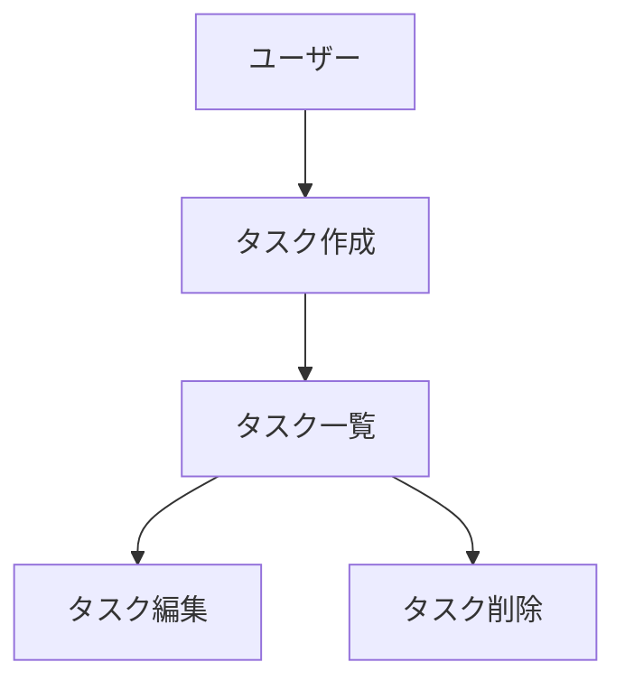

# CLAUDE.md (プロジェクトメモリ)

## 概要
開発を進めるうえで遵守すべき標準ルールを定義します。

---

## プロジェクト構造

### ドキュメントの分類

#### 1. 永続的ドキュメント（`docs/`）

アプリケーション全体の「**何を作るか**」「**どう作るか**」を定義する恒久的なドキュメント。
アプリケーションの基本設計や方針が変わらない限り更新されません。

- **product-requirements.md** - プロダクト要求定義書
  - プロダクトビジョンと目的
  - ターゲットユーザーと課題・ニーズ
  - 主要な機能一覧
  - 成功の定義
  - ビジネス要件
  - ユーザーストーリー
  - 受け入れ条件
  - 機能要件
  - 非機能要件

- **functional-design.md** - 機能設計書
  - 機能ごとのアーキテクチャ
  - システム構成図
  - データモデル定義（ER図含む）
  - コンポーネント設計
  - ユースケース図、画面遷移図、ワイヤフレーム
  - API設計（将来的にバックエンドと連携する場合）

- **architecture.md** - 技術仕様書
  - テクノロジースタック
  - 開発ツールと手法
  - 技術的制約と要件
  - パフォーマンス要件

- **repository-structure.md** - リポジトリ構造定義書
  - フォルダ・ファイル構成
  - ディレクトリの役割
  - ファイル配置ルール

- **development-guidelines.md** - 開発ガイドライン
  - コーディング規約
  - 命名規則
  - スタイリング規約
  - テスト規約
  - Git規約

- **glossary.md** - ユビキタス言語定義
  - ドメイン用語の定義
  - ビジネス用語の定義
  - UI/UX用語の定義
  - 英語・日本語対応表
  - コード上の命名規則


#### 2. 作業単位のドキュメント（`.steering/[YYYYMMDD]-[開発タイトル]/`）

特定の開発作業における「**今回何をするか**」を定義する一時的なステアリングファイル。
作業完了後は参照用として保持されますが、新しい作業では新しいディレクトリを作成します。

- **requirements.md** - 今回の作業の要求内容
  - 変更・追加する機能の説明
  - ユーザーストーリー
  - 受け入れ条件
  - 制約事項

- **design.md** - 変更内容の設計
  - 実装アプローチ
  - 変更するコンポーネント
  - データ構造の変更
  - 影響範囲の分析

- **tasklist.md** - タスクリスト
  - 具体的な実装タスク
  - タスクの進捗状況
  - 完了条件

### ステアリングディレクトリの命名規則

```
.steering/[YYYYMMDD]-[開発タイトル]/
```

**例：**
- `.steering/20250103-initial-implementation/`
- `.steering/20250115-add-tag-feature/`
- `.steering/20250120-fix-filter-bug/`
- `.steering/20250201-improve-performance/`

---

## 開発プロセス

### 初回セットアップ時の手順

#### 1. フォルダ作成

```bash
mkdir -p docs
mkdir -p .steering
```

#### 2. 永続的ドキュメント作成（`docs/`）

アプリケーション全体の設計を定義します。
各ドキュメントを作成後、必ず確認・承認を得てから次に進みます。

1. `docs/product-requirements.md` - プロダクト要求定義書
2. `docs/functional-design.md` - 機能設計書
3. `docs/architecture.md` - 技術仕様書
4. `docs/repository-structure.md` - リポジトリ構造定義書
5. `docs/development-guidelines.md` - 開発ガイドライン
6. `docs/glossary.md` - ユビキタス言語定義

**重要：** 1ファイルごとに作成後、必ず確認・承認を得てから次のファイル作成を行う

#### 3. 初回実装用のステアリングファイル作成

```bash
mkdir -p .steering/[YYYYMMDD]-initial-implementation
```

作成するドキュメント：
1. `.steering/[YYYYMMDD]-initial-implementation/requirements.md` - 初回実装の要求
2. `.steering/[YYYYMMDD]-initial-implementation/design.md` - 実装設計
3. `.steering/[YYYYMMDD]-initial-implementation/tasklist.md` - 実装タスク

#### 4. 環境セットアップ

#### 5. 実装開始

`.steering/[YYYYMMDD]-initial-implementation/tasklist.md` に基づいて実装を進めます。

#### 6. 品質チェック

### 機能追加・修正時の手順

#### 1. 影響分析

- 永続的ドキュメント（`docs/`）への影響を確認
- 変更が基本設計に影響する場合は `docs/` を更新

#### 2. ステアリングディレクトリ作成

```bash
mkdir -p .steering/[YYYYMMDD]-[開発タイトル]
```

**例：**

```bash
mkdir -p .steering/20250115-add-tag-feature
```

#### 3. 作業ドキュメント作成

各ドキュメント作成後、必ず確認・承認を得てから次に進みます。

1. `.steering/[YYYYMMDD]-[開発タイトル]/requirements.md` - 要求内容
2. `.steering/[YYYYMMDD]-[開発タイトル]/design.md` - 設計
3. `.steering/[YYYYMMDD]-[開発タイトル]/tasklist.md` - タスクリスト

**重要：** 1ファイルごとに作成後、必ず確認・承認を得てから次のファイル作成を行う

#### 4. 永続的ドキュメント更新（必要な場合のみ）

変更が基本設計に影響する場合、該当する `docs/` 内のドキュメントを更新します。

#### 5. 実装開始

`.steering/[YYYYMMDD]-[開発タイトル]/tasklist.md` に基づいて実装を進めます。

#### 6. 品質チェック

---

## ドキュメント管理の原則

### 永続的ドキュメント（`docs/`）
- アプリケーションの基本設計を記述
- 頻繁に更新されない
- 大きな設計変更時のみ更新
- プロジェクト全体の「北極星」として機能

### 作業単位のドキュメント（`.steering/`）
- 特定の作業・変更に特化
- 作業ごとに新しいディレクトリを作成
- 作業完了後は履歴として保持
- 変更の意図と経緯を記録

---

## 図表・ダイアグラムの記載ルール

### 記載場所
設計図やダイアグラムは、関連する永続的ドキュメント内に直接記載します。
独立したdiagramsフォルダは作成せず、手間を最小限に抑えます。

**配置例：**
- ER図、データモデル図 → `functional-design.md` 内に記載
- ユースケース図 → `functional-design.md` または `product-requirements.md` 内に記載
- 画面遷移図、ワイヤフレーム → `functional-design.md` 内に記載
- システム構成図 → `functional-design.md` または `architecture.md` 内に記載

### 記述形式
1. **Mermaid記法（推奨）**
   - Markdownに直接埋め込める
   - バージョン管理が容易
   - ツール不要で編集可能



2. **ASCII アート**
   - シンプルな図表に使用

```
┌─────────────┐
│   Header    │
└─────────────┘
       │
       ↓
┌─────────────┐
│  Task List  │
└─────────────┘
```

3. **画像ファイル（必要な場合のみ）**
   - 複雑なワイヤフレームやモックアップ
   - `docs/images/` フォルダに配置
   - PNG または SVG 形式を推奨

### 図表の更新
- 設計変更時は対応する図表も同時に更新
- 図表とコードの乖離を防ぐ

---

## 注意事項

- ドキュメントの作成・更新は段階的に行い、各段階で承認を得る
- `.steering/` のディレクトリ名は日付と開発タイトルで明確に識別できるようにする
- 永続的ドキュメントと作業単位のドキュメントを混同しない
- コード変更後は必ずリント・型チェックを実施する
- 共通のデザインシステム（Tailwind CSS）を使用して統一感を保つ
- セキュリティを考慮したコーディング（XSS対策、入力バリデーションなど）
- 図表は必要最小限に留め、メンテナンスコストを抑える

---

## このリポジトリ固有の情報

### Repository Overview

Personal eBay export resale tool. Scrapes Mercari Japan for sourcing candidates (keyword search and liked items), analyzes eBay sold prices, calculates profit, and sends alerts. All active code lives in `sourcing-tool/`.

The root also contains `ebay_sold_analyzer.py` (standalone legacy script run by GitHub Actions weekly) and `index.html`/`main.js`/`Code.gs` (unrelated Google Apps Script project).

### Session conventions

- **Shell**: PowerShell — use `;` not `&&` when chaining commands
- **After pushing changes**, always show the restart command: `git pull ; python -m src.main ui`
  (run from `sourcing-tool/`, port 8000)

### Commands

All commands must be run from `sourcing-tool/`:

```bash
cd sourcing-tool

# First-time setup
pip install -r requirements.txt
playwright install chromium
cp .env.example .env   # then fill in SERPAPI_KEY

# Fetch Mercari liked items (opens browser on first run for login)
python -m src.main likes --no-save    # preview only
python -m src.main likes --save       # save to DB

# Keyword-based sourcing pipeline (scrape → eBay check → profit analysis → alert)
python -m src.main scan
python -m src.main scan --source mercari --category game --dry-run

# Watchlist management
python -m src.main watchlist add game "ゲームボーイ"
python -m src.main watchlist list
python -m src.main watchlist import config.yaml

# DB status summary
python -m src.main status
```

### Architecture

#### Two independent pipelines

**`scan` pipeline** — keyword-driven, fully automated:
`watchlist keywords → BaseScraper.search() → source_listings DB → EbayAPI → profit_calculator → alerts`

**`likes` pipeline** — authenticated Mercari scraping:
`MercariLikesScraper (Playwright) → intercepts /v1/likedProducts API → source_listings DB`

Both pipelines write to the same `source_listings` table. The `source` column distinguishes them (`"mercari"`, `"hardoff"`, `"yahoo_auction"` vs `"mercari_likes"`).

#### Key design decisions

**`MercariLikesScraper` does not extend `BaseScraper`** — `BaseScraper` is built around `search(keyword, category)`. Liked items have no keyword and require user authentication, so `MercariLikesScraper` is a standalone class with `fetch_all_likes()`.

**Playwright runs headed (visible browser)** — headless mode triggers Mercari's bot detection. The browser session is saved to `data/mercari_session.json` after first login so subsequent runs are automatic.

**Mercari `/v1/likedProducts` API quirks** — responses nest product data under a `"product"` key with non-standard field names: `originId` (not `id`), `displayName` (not `name`), `price` as a string. This differs from the search API used by `MercariScraper`. The response also includes `stockState` (e.g. `PRODUCT_STOCK_STATE_OUT_OF_STOCK`) and `thumbnail` (single low-res image). Condition, description, and full-size images are **not** available from this endpoint — they must be fetched from individual item pages (`https://jp.mercari.com/item/{originId}`).

**`config.yaml` is the source of truth for all numeric constants** — fee rates, shipping estimates, profit thresholds, rate limits. Never hardcode these in source files.

**DB schema is managed via `_SCHEMA` in `database.py`** — `CREATE TABLE IF NOT EXISTS` on every startup; no migration framework. Adding columns requires both the schema string and any new methods in `Database`.

**Windows encoding** — `config.yaml` is UTF-8. `open()` calls must use `encoding="utf-8"` explicitly (Windows defaults to cp932).

#### Data models (`src/db/models.py`)

- `SourceListing` — sourced item from any channel. `(source, source_id)` is the unique key. `category` is `"game"`, `"audio"`, or `"unknown"` (likes items). `status` lifecycle: `new → analyzed → alerted/purchased/skipped`.
- `AnalysisResult` — profit calculation output, linked to `SourceListing`.
- `EbaySold` — raw eBay sold price records used to compute averages.
- `WatchlistItem` — keywords for the scan pipeline.

#### Environment variables (`.env`)

- `SERPAPI_KEY` — required for `EbayAPI` (eBay sold price lookup via SerpAPI)
- `SLACK_WEBHOOK_URL`, `LINE_NOTIFY_TOKEN` — optional alert channels
- `EBAY_CLIENT_ID`, `EBAY_CLIENT_SECRET` — eBay Inventory API 認証
- `ANTHROPIC_API_KEY` — Claude API（翻訳機能）

#### GitHub Actions

`.github/workflows/ebay-analysis.yml` runs `ebay_sold_analyzer.py` (the legacy standalone script, **not** `src/main.py`) on a weekly schedule and commits results CSV to `sourcing-tool/data/`. This workflow is independent of the `sourcing-tool/src/` codebase.

### Implemented pipeline (end-to-end)

```
likes → fetch-details → calc-price → eBay listing → sold-out removal (all done ✅)
```

| ステップ | コマンド/機能 | 状態 |
|---|---|---|
| いいね取得 | `likes --save` | ✅ |
| 詳細取得（状態・説明・画像） | `fetch-details` | ✅ |
| eBay価格計算 | `calc-price` | ✅ |
| eBay出品（単品・最大10件同時） | Web UI → 出品ボタン | ✅ |
| 出品取り消し | Web UI → 取り消しボタン / `fetch-details` 売切れ自動 | ✅ |
| Claude翻訳 + プロンプト編集 | 編集画面 → 翻訳ボタン | ✅ |
| いいね解除検知（コンソール） | `likes --save` 実行時に自動 | ✅ |

### Deferred tasks

- いいね解除・売切れ商品の Web UI 表示（`status='withdrawn'` 新設 + 売切れタブ統合）

### Navigation

Steering documents for in-progress tasks: `.steering/<date>-<task>/` (requirements, design, tasklist).
Permanent architecture docs: `docs/`.
